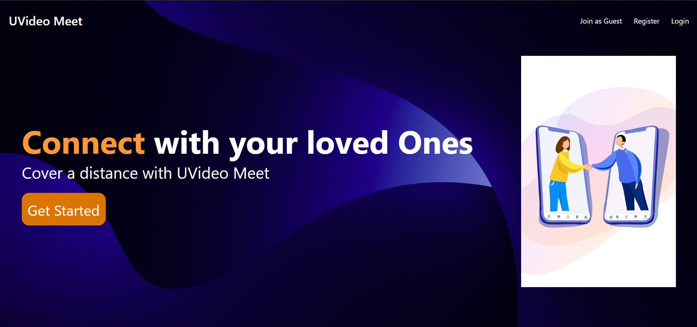

# 🎥 UVideo Meet

A full-stack Zoom Clone built using **React.js, Node.js, Express.js, Socket.io, and MongoDB Atlas**.

---

## 📌 Features

- 🔐 User Registration
- 🔑 User Login
- 🎥 Create Video Meeting
- 🔗 Join Meeting using Meeting Code
- 👥 Real-Time Video Calling
- 📜 Meeting History
- ☁️ MongoDB Atlas Database
- 🔒 Password Encryption using bcrypt
- ⚡ Socket.io for Real-Time Communication
- 📱 Responsive User Interface

---

## 🛠 Tech Stack

### Frontend
- React.js
- Material UI
- Axios
- React Router

### Backend
- Node.js
- Express.js
- Socket.io
- MongoDB Atlas
- Mongoose
- bcrypt
- dotenv

---

## 📸 Screenshot




---

## 📂 Project Structure

```
UVideo Meet
│
├── frontend
├── backend
└── README.md
```

---

## ⚙️ Installation

### Clone Repository

```bash
git clone https://github.com/urvashi-sarvaiya/UVideo-Meet---Zoom-Clone-.git
```

### Install Frontend

```bash
cd frontend
npm install
npm start
```

### Install Backend

```bash
cd backend
npm install
npm run dev
```

---

## 🌐 Environment Variables

Create a `.env` file inside the backend folder.

```env
PORT=8000
MONGO_URI=YOUR_MONGODB_CONNECTION_STRING
```

---

## 👩‍💻 Author

**Urvashi Sarvaiya**

GitHub: https://github.com/urvashi-sarvaiya

---

⭐ If you like this project, don't forget to give it a star.